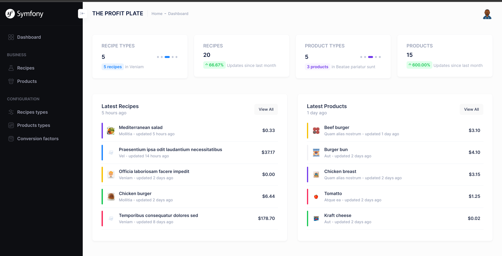
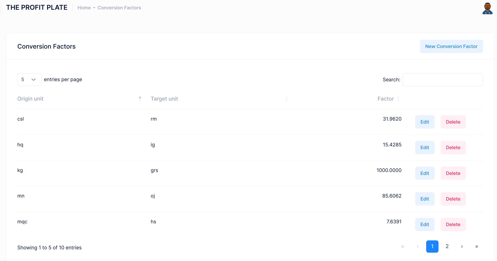
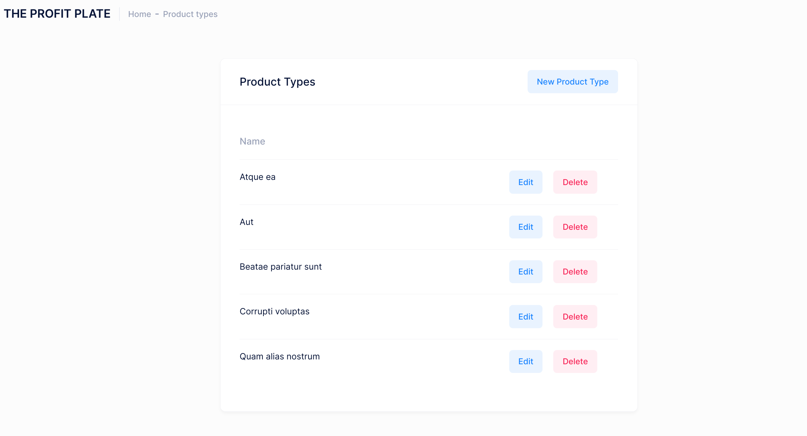
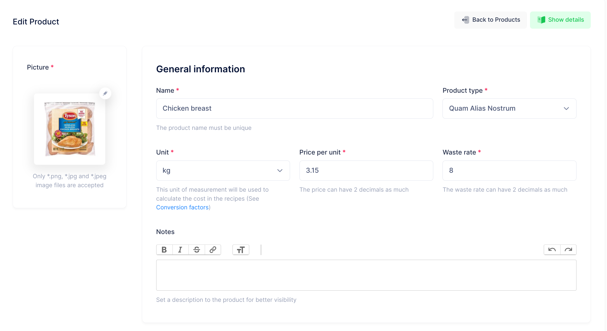
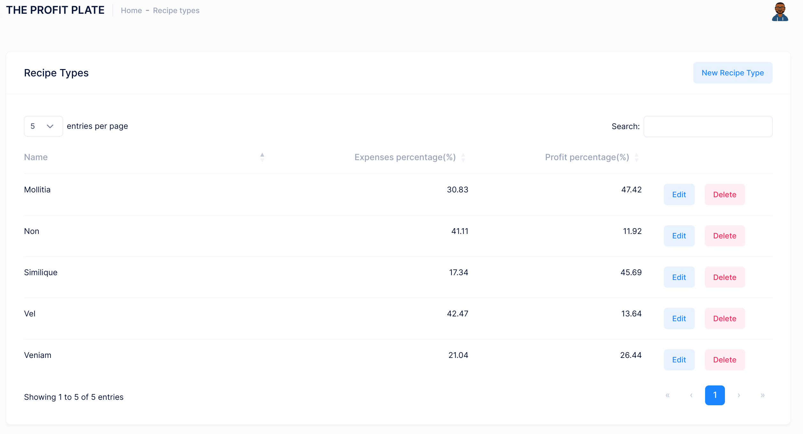
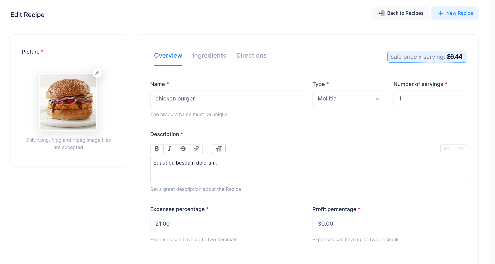
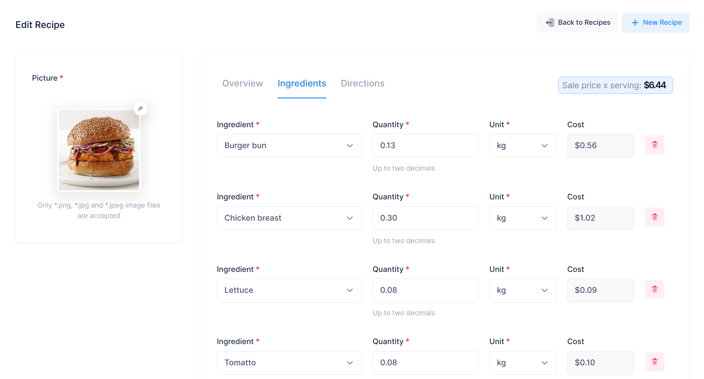
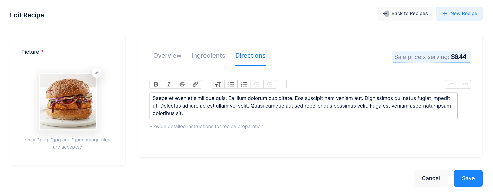

# The Profit Plate

Are you tired of guessing the right price for your restaurant menu items? Look
no further! Our Symfony application is here to help you calculate the perfect
sale price for any menu item. It takes into account the cost of each ingredient,
your desired profit margin, and additional expenses for an accurate pricing
structure.

This application is not only effective, but also showcases the latest Symfony
development trends. With sleek Twig components for an intuitive user interface,
Live components for real-time updates, and StimulusJS for a touch of JavaScript
magic, this app is designed to provide you with optimal pricing solutions. Plus,
the code has been written with good practices in mind, ensuring maintainable and
testable code.

Say goodbye to menu margin meltdowns and take control of your restaurant's 
profitability with our data-driven pricing application.

## The stack used for this implementation
[]()
[]()
[]()

## Setup the environment

Clone this repository:
```shell
git clone https://github.com/cobisja/the-profit-plate.git .
```

Install the dependencies:
```shell
composer install
```
Start the database container:
```shell
docker compose up -d
```
Start the local web server:

Option #1: Symfony CLI

If you have installed **Symfony CLI** you can run the integrated server
```shell
symfony server:start -d
```

Option #2: PHP server
```shell
php -S localhost:8000 -t public/
```

Create the database:
```shell
php bin/console doctrine:database:create
```

Run the migrations:
```shell
php bin/console doctrine:migrations:migrate
```

Load the fixtures (optional):
```shell
php bin/console doctrine:fixtures:load
```

## Using the application



### Fill the Conversion table

You define here all the factors required to perform conversions between unit of
measure (e.g. kg -> grs).

The information requested is:

* Origin unit (from)
* Target unit (to)
* Conversion factor



### Define the Product Types
This acts as categories for products

The requested data is as follows:

* name



### Register the Products

Here, you define every product, providing:

* Image
* Name
* Type (one of the values defined above)
* Unit
* Price per unit
* Waste rate (as percent)
* Notes (Any information related. Not required)



### Define the Recipe Types
These act as "Recipe categories".

Required data:

* Name
* Expenses percentage (applicable to all recipes of this type)
* Profit percentage (applicable to all recipes of this type)



### Define the Recipes
Finally, you define the Recipes based on the information set above. The
requested is:

* Image
* Name
* Type
* Number of servings
* General description
* Expenses percentage
* Profit percentage
* The ingredients list:
  * Ingredient (product)
  * Quantity
  * Unit of measure
* Directions

#### Recipe overview


#### Recipe ingredients


#### Recipe directions


Any time you change the value of the following fields, the Sale price is automatically
recalculated:

* Number of servings
* Expenses percentage
* Profit percentage
* Ingredient list:
  * Quantity
  * Unit 

And that's it! You have defined your Menu recipes to set their sale prices.

I hope you like what I've done. If so, please leave a comment. If you think I could do the things
in a different (and easier) way, please leave a comment. I would appreciate it.

Thanks so much!,

Cobis
